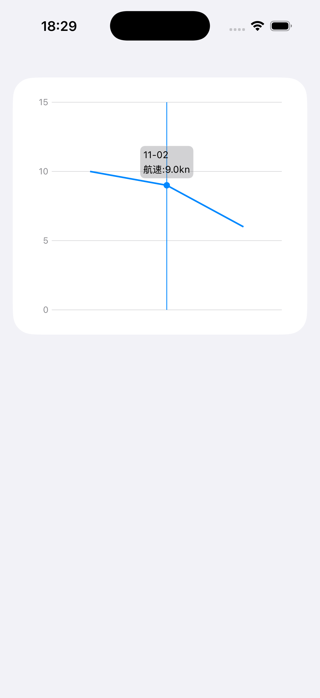

# 📊 ChartsDemo

基于 **SwiftUI** 和 **Swift Charts** 框架构建的轻量级数据可视化示例项目，支持点击交互显示 X/Y 轴数值，演示了如何绘制可自定义的折线图（Line Chart），并通过格式化闭包灵活控制 X/Y 轴的显示样式。

---

## 🧩 功能简介

- 使用 `LineChartPoint` 构建折线图数据模型  
- 支持通过 `xFormatter` / `yFormatter` 自定义标签格式  
- 支持 **字面量初始化方式**（可直接用数组或字典定义数据点）  
  
<p align="center">
  
</p>
---

## 💡 示例代码

```swift
// 常规初始化
let arr = [
    LineChartPoint(x: "1730419200", y: 10),
    LineChartPoint(x: "1730505600", y: 9),
    LineChartPoint(x: "1730592000", y: 6.0),
    LineChartPoint(x: "1730678400", y: 8.0),
]

// 字面量初始化（支持数组和字典方式）
let arr1: [LineChartPoint] = [
    ["1730419200", 10], // 数组字面量
    LineChartPoint(x: "1730505600", y: 9), // 常规方式
    ["x": "1730592000", "y": 6.0] // 字典字面量
]

// 传入图表组件
LineChartDemoView(data: arr1) { y in
    "航速: \(y)kn"
} xFormatter: { x in
    if let ts = TimeInterval(x) {
        let date = Date(timeIntervalSince1970: ts)
        let formatter = DateFormatter()
        formatter.dateFormat = "MM-dd"
        return formatter.string(from: date)
    }
    return ""
}


